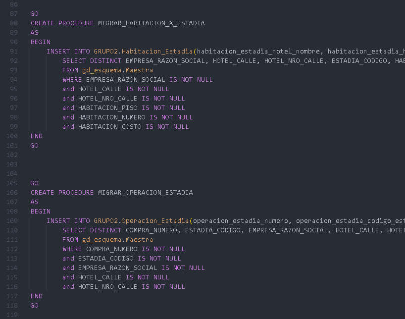

# 💽 Trabajo Práctico de SQL

Trabajo práctico realizado con un grupo de 5 integrantes para la materia Gestión de Datos de la UTN FRBA

## Documentos Auxiliares
### DER 
[https://app.lucidchart.com/documents/edit/e90947c7-a575-4528-96fc-285d413323b0/0_0](https://app.lucidchart.com/documents/edit/e90947c7-a575-4528-96fc-285d413323b0/0_0)

### Estrategia
[https://docs.google.com/document/d/1V5PtIWA2gxQkTbDC8KsmCxIxNef9dbu6PhCipTX4I84/edit?usp=sharing](https://docs.google.com/document/d/1V5PtIWA2gxQkTbDC8KsmCxIxNef9dbu6PhCipTX4I84/edit?usp=sharing)

Made by Ignacio Keiniger

